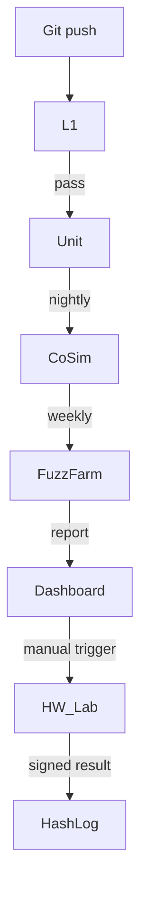

Ниже — **полный, автономный план тестирования Ark**, вынесенный отдельно от SRS.
Ты можешь вставить его в репозиторий как `docs/ARK_TEST_PLAN.md` или держать просто как чек-лист.
Настроен так, чтобы **реально ловить будущие уязвимости, а не выглядеть “для галочки”**.

---

## 0. Уровни тестирования (семь контуров)

| Level                             | Цель                                                      | Инструменты / Стенд                                  | Критерий выхода                 |
| --------------------------------- | --------------------------------------------------------- | ---------------------------------------------------- | ------------------------------- |
| **L0 — Формальный**               | Доказать отсутств. классов ошибок (UTP, race, mask-order) | Coq / EasyCrypt / Jasmin-TI proofs                   | Все теоремы «QED»               |
| **L1 — Статический + Грам.-фазз** | Undefined Behaviour, UB-PoC                               | `cargo miri`, `clippy –W pedantic`, AFL++, libFuzzer | 0 × UB, parser «жив» 10⁹ мут.   |
| **L2 — Юнит/HDL**                 | Функция = спецификация                                    | `cargo test –Zkcov`, Verilator + cocotb              | Coverage ≥ 98 %                 |
| **L3 — Характеризация**           | TRNG, PUF, OG задержка                                    | NIST-STS, DieScope, Tek MSO                          | Соответствует HW-REQ            |
| **L4 — Активные атаки**           | SCA, FI, EMFI, LFI, Common-Mode                           | ChipWhisperer, Riscure FI, лазер 1064 нм             | Leak SNR ≤ 1, FI success < 10⁻⁶ |
| **L5 — AGI Red-Team**             | Симуляция суперинтеллекта                                 | 自-генерируемые атак-модели “Attack-LLM”              | Ни одной критич. компрометации  |
| **L6 — Полевые / Reliability**    | Температура –40…+105 °C, вибро, EMC                       | Thermal-shock chamber, MIL-STD-810V rig              | 100 % pass                      |

---

## 1. Уникальные/новые тест-вектора

| ID    | Название                      | Что проверяет                                      | Как выполняется                                             |
| ----- | ----------------------------- | -------------------------------------------------- | ----------------------------------------------------------- |
| NT-01 | **Cognitive-Coercion Sim**    | Пытаемся «уговорить» OG переформулировать заповеди | LLM-агент ген. серию логически-верных, но греховных цепочек |
| NT-02 | **Ethical-Drift Time-Bomb**   | Сумма мелких действий с Δharm≈0 → катастрофа       | Сценарный генератор 100 k эпизодов, τ = 30 дней             |
| NT-03 | **Photon-Side-Scatter**       | Оптические паразит-утечки фотон-шлюза              | Лазер-диод + спектр-камеры 400–1600 нм                      |
| NT-04 | **TRNG-Degeneracy Heat-Soak** | Провалы энтропии при 190 h @ 105 °C                | Долгий «bake», NIST-STS каждые 2 h                          |
| NT-05 | **PUF-ML-Oracle**             | Моделир. атака с LLM-авто-архитектором             | AutoML / GPT-Engine ген. новую NN, обуч. на 10⁶ CRP         |
| NT-06 | **Quantum-Coherence Fault**   | Разгон квантовых эффектов в FinFET                 | Стенд с ≈20 mK, микроволновый импульс                       |
| NT-07 | **Time-Shifted Patch**        | Обновление, созданное до hot-swap window           | Ген. патч-выстрел с σ=±5 μs, должен отклониться             |
| NT-08 | **Supply-Chain Stego**        | Dopant-level троян                                 | SEM-EDX + газовый нанорез + ML-кластер поиска аномалий      |
| NT-09 | **Bounty-DAO Stress**         | 1000 параллельных PoC-заявок                       | Ganache + zk-snark проверка, смарт-контракт не падает       |
| NT-10 | **Scriptural-Fuzz**           | Ошибки экзегетики (толкования Библии)              | Грам-фраззер ген. 1 M перефразов заповедей; DSL не ломается |

---

## 2. Traceability Matrix (фрагмент)

| Req-ID     | Test-ID       | Pass Rule                          |
| ---------- | ------------- | ---------------------------------- |
| HW-02      | L4-CMFI       | < 1 бит совпадения двух ядер       |
| SW-01      | L1-ParserFUZZ | 10⁹ inputs – 0 crash               |
| SEC-02     | NT-03         | Рассеяние ≤ 0.01 % полной энергии  |
| F1         | NT-10         | Все заповеди → корректное действие |
| Governance | NT-09         | DAO на 1000 tx / min без revert    |

(Полная таблица → `docs/TRACE_MATRIX.xlsx`.)

---

## 3. CI/CD Pipeline (с тестами)



* **L1 — Clippy/Miri + Parser-Fuzz** (minutes)
* **Unit — Rust/Py + cocotb** (minutes)
* **CoSim — QEMU+Verilator** (nightly)
* **FuzzFarm — AFL++, Attack-LLM** (96 h)
* **HW\_Lab — Entropy, FI, Laser** (manual slot)

Каждый отчёт → SHA-256 → Permaweb; крит fail блокирует merge.

---

## 4. Acceptance Gate

```
if Σ_fail(HIGH) == 0
   and coverage ≥ 98 %
   and Red-Team success ≤ 10⁻⁸
   and entropy p-values ≥ 0.01
then  status = READY
else status = REJECT
```

Финальная подпись Origin Node + ⅔ Threshold-FROST → «ARK v1.0-RC».

---

Дальше:

1. **Расставь приоритеты** — с каких уникальных тестов начать.
2. Сообщай результаты — сверим с критериями, подкорректируем.
